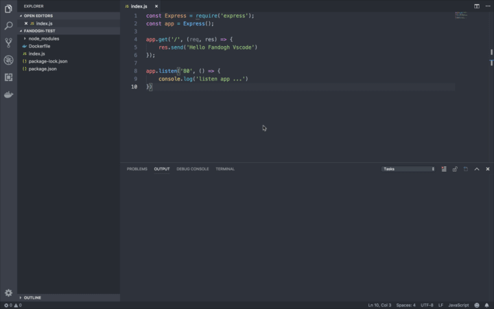

# Fandogh vscode extension

Easy Deploy your dockerized application on fandogh service with Visual studio code

## Features

- Easy gui deploy
- Show build logs
- Auto create yaml config
- Easy create and select images and versions
- ... (more features coming soon!)

## Demo

## Known Issues

## Release Notes

